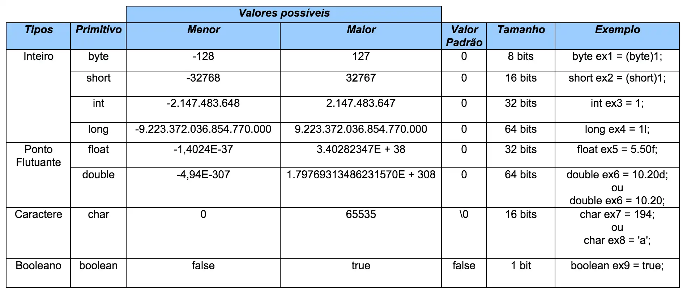

# Resumo da Aula de Estruturas de Dados 📚

Um PC possui diversos componentes de hardware para funcionar corretamente,
mas sem dúvidas o mais importante para esta disciplina é a memória RAM. 🖥️

Os programas que desenvolvemos geralmente utilizam a memória RAM para
gravar e ler dados.

Temos dois tipos principais de memória: secundária e primária.

- **Memória Secundária**: Mantém dados mesmo sem energia.
- **Memória Primária**: Não funciona assim; ela só mantém dados
armazenados na presença de energia.

Podemos entender a memória RAM da seguinte forma: ela é composta por
diversos chips com endereços de memória, como se fossem regiões na
memória que o sistema operacional gerencia. Esses chips conseguem manter
milhões de bits por algum tempo, e cada chip possui diversos bits capazes
de guardar informações.

Cada chip pode ser dividido em vários bits, e esses bits podem
armazenar 0 ou 1, por serem baseados na arquitetura binária. Quando um
bit é 1, passa energia.

Em Java, não temos muito acesso a esses detalhes como na linguagem C,
por exemplo, devido a ser uma linguagem de alto nível e à JVM (Java
Virtual Machine) atuar como uma camada intermediária na execução dos
arquivos.

## Tipos Primitivos de Java

*Imagem que mostra os tipos primitivos em Java.*

### Precisão dos Tipos de Dados
- **float**: Aproximadamente 7 dígitos decimais.
- **double**: Aproximadamente 15 dígitos decimais.
